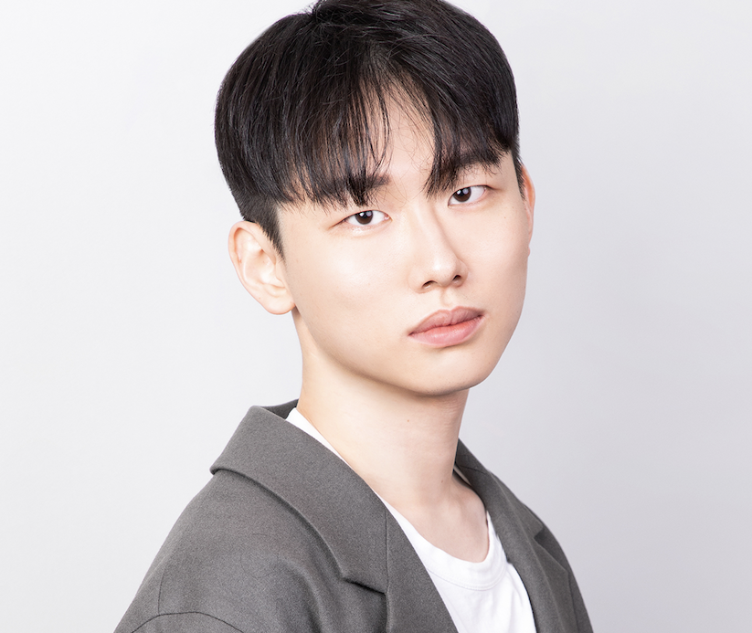
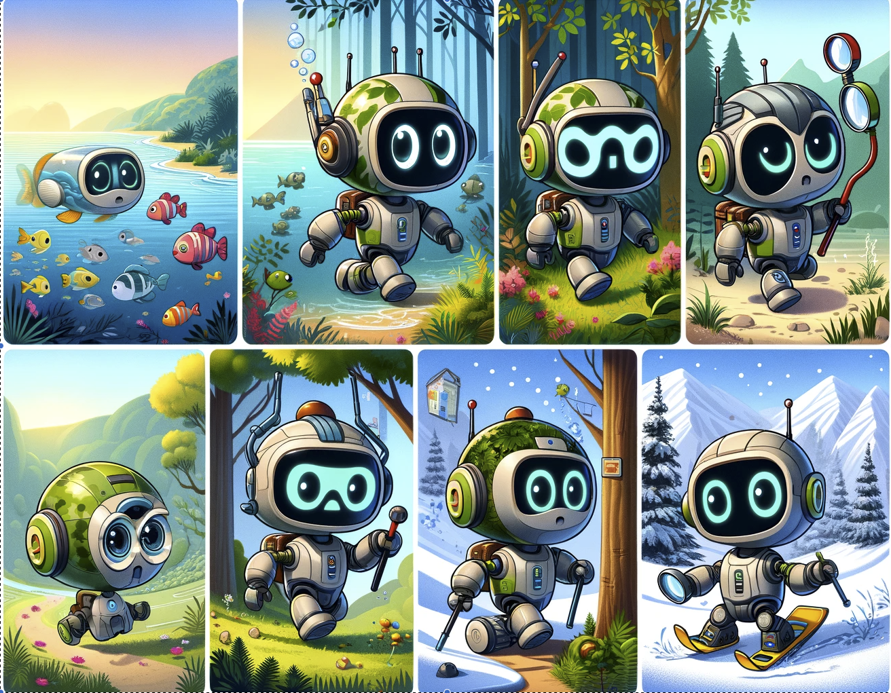
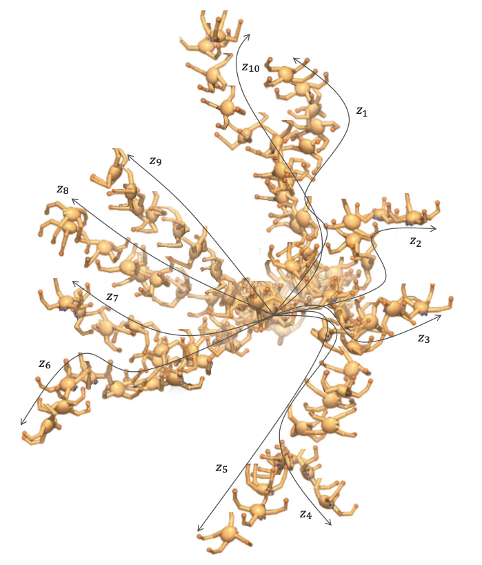
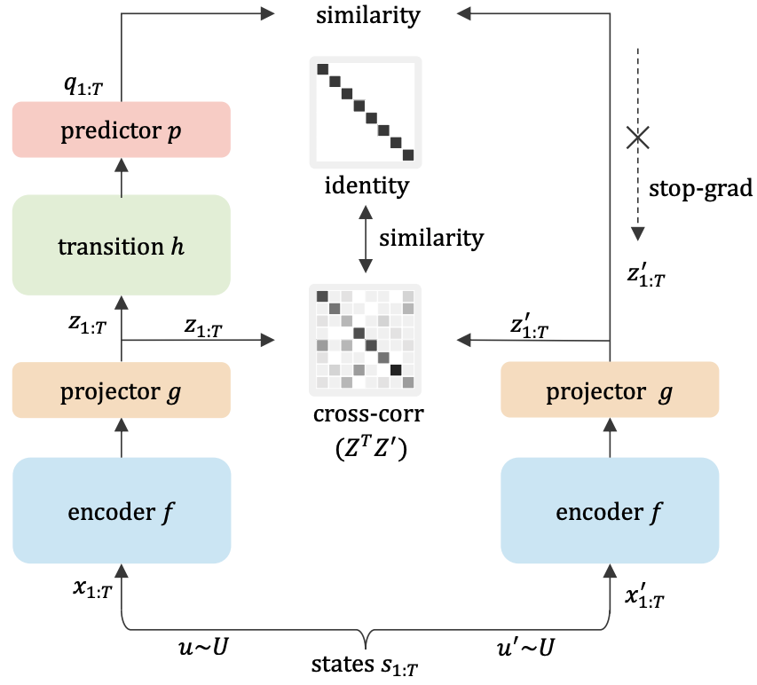
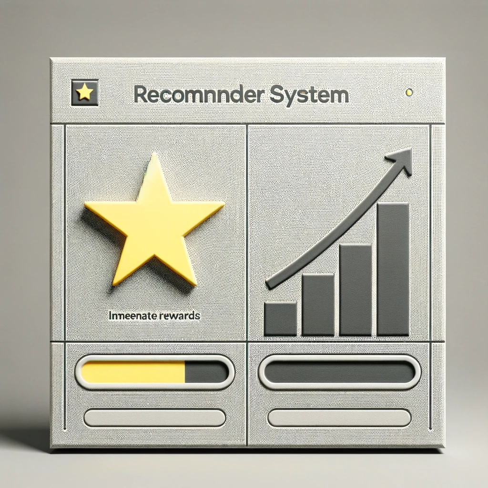
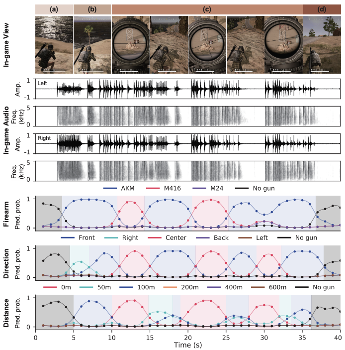

---
# the default layout is 'page'
icon: fas fa-info-circle
order: 3
---

 
 

   
 I am a Ph.D student at KAIST AI, advised by <a href="https://sites.google.com/site/jaegulchoo/">Jaegul Choo</a>.   Previously, I received M.S at KAIST, and B.S at Korea University.    

   My research interest lies in representation learning and its application to decision-making, which includes games, sports, and robotics.
  

<a href="joonleesky@kaist.ac.kr">Email</a> &nbsp;·&nbsp;
<a href="../assets/pdf/cv_20231118.pdf">CV</a> &nbsp;·&nbsp; 
<a href="https://scholar.google.com/citations?user=g0R5CDMAAAAJ&hl=ko">Scholar</a> &nbsp;·&nbsp; 
<a href="https://github.com/joonleesky">Github</a>  

Last updated: Nov 14, 2023

 

###  News

- **Mar-Aug 2024:** I will be joining a <a href="https://www.gran-turismo.com/us/gran-turismo-sophy/"> Gran Turismo team </a> 
                    at <a href="https://ai.sony/">Sony AI</a>, Tokyo, as a research intern.  
- **Sep 2023:** Two reinforcement learning papers got accepted in NeurIPS'23.  
- **Jun 2023:** A short paper on real-estate apprisal got accepted in CIKM'23.  
- **May 2023:** A paper on video representation learning got accepted in ICML'23.

###  Research

Most of my research lies in representation learning, reinforcement learning, and its applications. 

    
    

        
 
            <strong><a href="https://arxiv.org/abs/2306.05637" style="text-decoration: none;"> 
                Enhancing Input and Label Plasticity for Sample Efficient Reinforcement Learning
            </a></strong>  
            <strong>Hojoon Lee*</strong>, Hanseul Cho*, <a href="https://mynsng.github.io/">Hyunseung Kim*</a>, Daehoon Gwak, Joonkee Kim, Jaegul Choo, Se-Young Yun, Chulhee Yun.  
        <i> NeurIPS'23.</i>  
        <a href="https://arxiv.org/abs/2306.10711">arXiv</a> /
        <a href="https://github.com/dojeon-ai/plastic">code</a> /
        <a href="https://drive.google.com/file/d/1-QeWhom9l7mUt3m7zJV-_DIGMtL7F2Cq/view?usp=sharing">slide</a> /
        <a href="https://drive.google.com/file/d/1-OTP_-rw2x-csjsJ9jH7utuHw9zDxsJc/view?usp=sharing">poster</a> 
        

        
 
        We construct a sample‑efficient RL algorithm by preserving the model's input & label plasticity throughout training. 
        

    

    
    

        
 
            <strong><a href="https://openreview.net/forum?id=Bkrmr9LjeI" style="text-decoration: none;"> 
                DISCO-DANCE: Learning to Discover Skills through Guidance
            </a></strong>  
            <a href="https://mynsng.github.io/">Hyunseung Kim*</a>, Byungkun Lee*, <strong>Hojoon Lee</strong>, Dongyoon Hwang, Kyushik Min, Sejik Park, Jaegul Choo.  
        <i> NeurIPS'23.</i>  
        <a href="https://mynsng.github.io/discodance/">project page</a> /
        <a href="https://arxiv.org/abs/2310.20178">arXiv</a> /
        <a href="https://github.com/dojeon-ai/discodance">code</a> 
        
 
        We introduce an Unsupervised Skill Discovery algorithm designed to encourage exploration by a direct guidance.
        

        

    

    
    

        
 
            <strong><a href="https://arxiv.org/abs/2306.05637" style="text-decoration: none;"> 
                On the Importance of Feature Decorrelation for Unsupervised Representation Learning for Reinforcement Learning
            </a></strong>  
            <strong>Hojoon Lee</strong>, Koanho Lee, Dongyoon Hwang, Hyunho Lee, Byungkun Lee, and Jaegul Choo.  
        <i> ICML'23.</i>  
        <a href="https://arxiv.org/abs/2306.05637">arXiv</a> /
        <a href="https://github.com/dojeon-ai/SimTPR">code</a> /
        <a href="https://drive.google.com/file/d/1FPJHtd3uY54P2iOoPBrnt8jD-ud6nF6G/view?usp=sharing">poster</a> 
        

        
 
        We introduce an offline self-predictive learning algorithm for reinforcement learning.
        

    

    
    

        
 
            <strong><a href="https://dl.acm.org/doi/10.1145/3583780.3615168" style="text-decoration: none;"> 
                ST-RAP: A Spatio-Temporal Framework for Real Estate Appraisal 
            </a></strong>  
            <strong>Hojoon Lee*</strong>, Hawon Jeong*, Byungkun Lee*, Kyungyup Lee, and Jaegul Choo.  
        <i> CIKM'23 (short).</i>  
        <a href="https://arxiv.org/abs/2308.10609v1">arXiv</a> /
        <a href="https://github.com/dojeon-ai/STRAP">code</a> /
        <a href="https://drive.google.com/file/d/1ht5I6-PQmzlVzF-1YQCkBO1XcrVGbjk7/view?usp=sharing">poster</a> 
        

        
 
        We construct a real estate appraisal framework that integrates spatial and temporal aspects.
        

    

    
    

        
 
            <strong><a href="https://dl.acm.org/doi/10.1145/3477495.3531869" style="text-decoration: none;"> 
                Towards Validating Long-Term User Feedbacks in Interactive Recommender System
            </a></strong>  
            <strong>Hojoon Lee</strong>, Dongyoon Hwang, Kyusik Min, and Jaegul Choo.  
        <i> SIGIR'22 (short), <strong>Honorable Mention Award</strong>.</i>  
        <a href="https://drive.google.com/file/d/13PEGDMrfZaG-PcCp0tx-A_L_2E1MKqQm/view?usp=sharing">poster</a> 
        

        
 
        We analyze the limitations of existing interactive recommender systems' benchmarks. 
        

    

    
    

        
 
            <strong><a href="https://dl.acm.org/doi/10.1145/3485447.3512278" style="text-decoration: none;"> 
                DraftRec: Personalized Draft Recommendation for Winning in Multiplayer Online   Battle Arena Games
            </a></strong>  
            <strong>Hojoon Lee*</strong>, Dongyoon Hwang*, <a href="https://mynsng.github.io/">HyunSeung Kim</a>, Byungkun Lee, and Jaegul Choo.  
        <i> WWW'22.</i>  
        <a href="https://arxiv.org/abs/2204.12750">arXiv</a> /
        <a href="https://github.com/dojeon-ai/DraftRec">code</a> /
        <a href="https://drive.google.com/file/d/15L2ZqVutI3xjwJXq9NGbizSZbNsQEXOK/view?usp=sharing">poster</a>
        

        
 
        We construct a personalized champion recommendation system for League of Legends with using a hierarchical transformer architecture.
        

    

    
    

        
 
            <strong><a href="https://arxiv.org/abs/2210.05917" style="text-decoration: none;"> 
                Enemy Spotted: In-game Gun Sound Dataset for Gunshot Classification and Localization
            </a></strong>  
            Junwoo Park, Youngwoo Cho, Gyuhyeon Sim, <strong>Hojoon Lee</strong>, and Jaegul Choo.  
        <i> COG'22.</i>  
        <a href="https://arxiv.org/abs/2210.05917">arXiv</a> 
        

        
 
        We construct the in-game gunshot sound dataset which can enhance the accuracy of real‑world firearm classification.
        

    

[jaegul_choo_google_link]: https://sites.google.com/site/jaegulchoo/
[davian_link]: http://davian.kaist.ac.kr/
[github_link]:https://github.com/joonleesky
[cv]: https://drive.google.com/file/d/1Ay8pS_bMZ_6lMiN_OzLPfRQEQK5vVqyq/view?usp=sharing