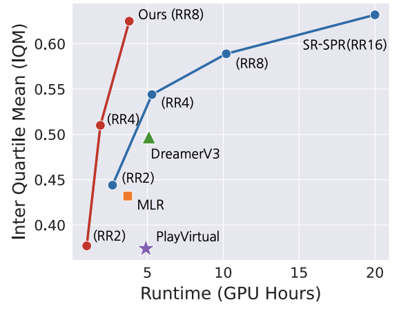
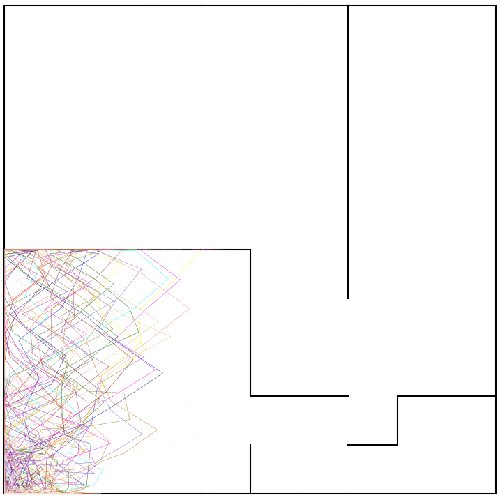
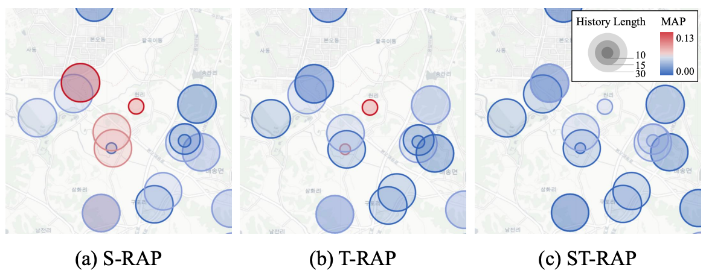
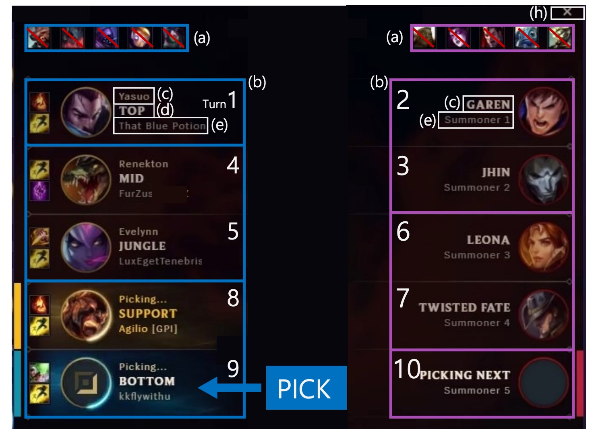

---
# the default layout is 'page'
icon: fas fa-info-circle
order: 3
---

 
 

   
 I am a second year Ph.D. student in KAIST AI, advised by <a href="https://sites.google.com/site/jaegulchoo/">Jaegul Choo</a>. Previously, I received a M.S degree in KAIST AI at 2022, and received a B.S degree in CS at Korea University, 2020.    

My research interest lies in <b>Representation Learning </b> and its application to <b> Decision Making</b>. 
I aim to develop effective representation learning method for decision making from high-dimensional, unstructured data such as images, videos, and languages. Then, my goal is to leverage these representations to enhance decision making in real-world applications such as games, sports, and robotics.
  

 

<a href="../assets/pdf/cv_20230922.pdf"><strong>CV</strong></a> &nbsp;·&nbsp; <a href="https://github.com/joonleesky"><strong>github</strong></a> &nbsp;·&nbsp; joonleesky@kaist.ac.kr  

Last updated: Sep 22, 2023

## Representation Learning

    
    

        <h5> Enhancing Input and Label Plasticity for Sample Efficient Reinforcement Learning</h5>
        
 <strong>Hojoon Lee*</strong>, Hanseul Cho*, Hyunseung Kim*, Daehoon Gwak, Joonkee Kim, Jaegul Choo, Se-Young Yun, Chulhee Yun. NeurIPS 2023.  
        <a href="https://arxiv.org/abs/2306.10711">[paper]</a>

    

    
    

        <h5> Learning to Discover Skills through Guidance </h5>
        
 Hyunseung Kim*, Byungkun Lee*, <strong>Hojoon Lee</strong>, Dongyoon Hwang, Kyushik Min, Sejik Park, Jaegul Choo. NeurIPS 2023.   

    

    
    

        <h5> On the Importance of Feature Decorrelation for Unsupervised Representation Learning for Reinforcement Learning</h5>
        
<strong>Hojoon Lee</strong>, Koanho Lee, Dongyoon Hwang, Hyunho Lee, Byungkun Lee, and Jaegul Choo. ICML 2023.  
        <a href="https://arxiv.org/abs/2306.05637">[paper]</a>
        <a href="https://github.com/dojeon-ai/SimTPR">[code]</a>
        <a href="https://drive.google.com/file/d/1FPJHtd3uY54P2iOoPBrnt8jD-ud6nF6G/view?usp=sharing">[poster]</a>

    

    
    

        <h5> Learning Representations by Contrasting Clusters while Bootstrapping Instances.</h5>
        
Junsoo Lee*, <strong>Hojoon Lee*</strong>, Inkyu Shin, Jaekyoung Bae, Inso Kweon,   and Jaegul Choo. Preprint 2021.  
        <a href="https://openreview.net/forum?id=MRQJmsNPp8E">[paper]</a>

    

## Applications 

    
    

        <h5> ST-RAP: A Spatio-Temporal Framework for Real Estate Appraisal</h5>
        
<strong>Hojoon Lee*</strong>, Hawon Jeong*, Byungkun Lee*, Kyungyup Lee, and Jaegul Choo. CIKM 2023 (short).  
        <a href="https://arxiv.org/abs/2308.10609">[paper]</a>

    

    
    

        <h5> Towards Validating Long-Term User Feedbacks in Interactive Recommender System</h5>
        
<strong>Hojoon Lee</strong>, Dongyoon Hwang, Kyusik Min, and Jaegul Choo.  
        SIGIR 2022 (short, Honorable Mention).  
        <a href="https://dl.acm.org/doi/abs/10.1145/3477495.3531869">[paper]</a>
        <a href="https://drive.google.com/file/d/13PEGDMrfZaG-PcCp0tx-A_L_2E1MKqQm/view?usp=sharing">[poster]</a>

    

    
    

        <h5> DraftRec: Personalized Draft Recommendation for Winning   in Multiplayer Online Battle Arena Games.</h5>
        
<strong>Hojoon Lee*</strong>, Dongyoon Hwang*, HyunSeung Kim, Byungkun Lee,   and Jaegul Choo. WWW 2022.  
        <a href="https://arxiv.org/abs/2204.12750">[paper]</a>
        <a href="https://github.com/dojeon-ai/DraftRec">[code]</a>
        <a href="https://drive.google.com/file/d/15L2ZqVutI3xjwJXq9NGbizSZbNsQEXOK/view?usp=sharing">[poster]</a>

    

    
    

        <h5> Enemy Spotted: In-game Gun Sound Dataset for Gunshot Classification and Localization.</h5>
        
Junwoo Park, Youngwoo Cho, Gyuhyeon Sim, <strong>Hojoon Lee</strong>, and   Jaegul Choo. COG 2022.  
        <a href="https://arxiv.org/abs/2210.05917">[paper]</a>

    

[jaegul_choo_google_link]: https://sites.google.com/site/jaegulchoo/
[davian_link]: http://davian.kaist.ac.kr/
[github_link]:https://github.com/joonleesky
[cv]: https://drive.google.com/file/d/1Ay8pS_bMZ_6lMiN_OzLPfRQEQK5vVqyq/view?usp=sharing