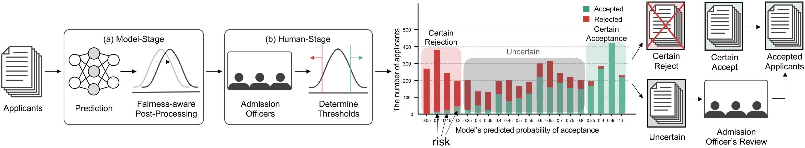
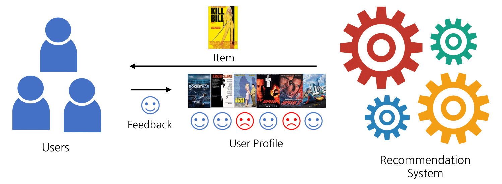
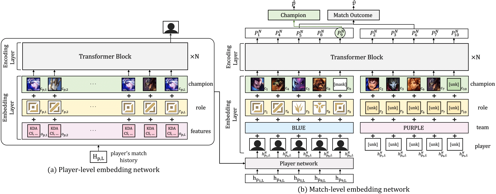
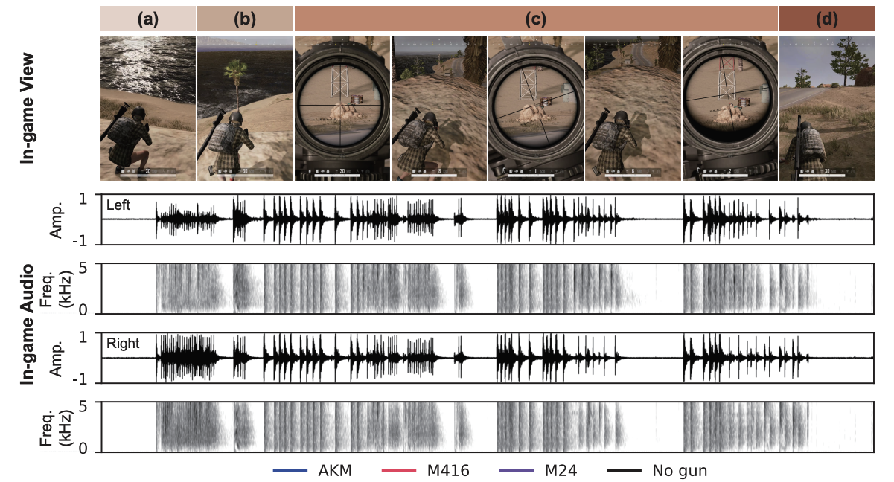
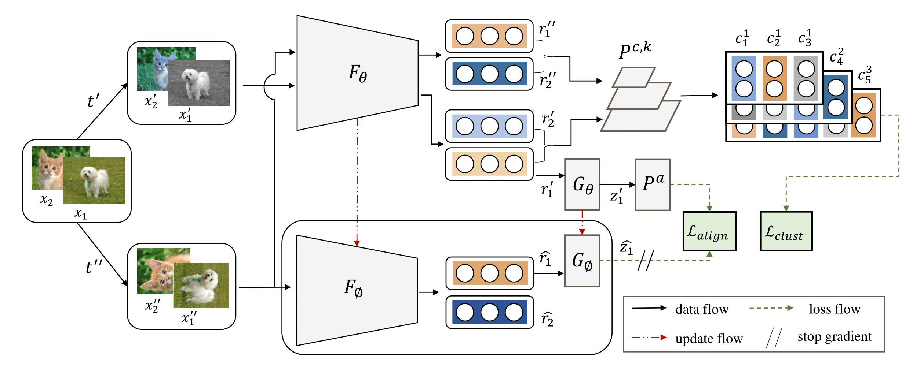

---
# the default layout is 'page'
icon: fas fa-info-circle
order: 4
---

{: .left w="270 h="270" .shadow}

 
I am a first year Ph.D. student in **KAIST AI**, advised by [**Jaegul Choo**][jaegul_choo_google_link].  
Previously, I received a M.S degree in **KAIST AI** at 2022,  
and received a B.S degree in CS at **Korea University**, 2020.  

&nbsp;&nbsp;[**CV**][cv] &nbsp;·&nbsp; [**github**][github_link] &nbsp;·&nbsp; **joonleesky@kaist.ac.kr**  

Last updated: Dec 22, 2022
   

## Research Interests
My research goal is to develop a **data-driven AI in sports** that can help players to analyze their abilities and enhance their experience. To develop such system, my interest lies in **Representation Learning** and **Decision Making**.
  
I am interested in Representation Learning to extract structured knowledge from complex and unstructured sports data (e.g., you can think of extracting each player’s location from a broadcast video dataset).  
I am interested in Decision making to derive insights and analysis from structured representations.
   

## Publications
##### \[P2\] Towards Risk-Minimized and Fairness-Maximized Human-in-the-Loop Evaluation.
{: w="700" h="300" .shadow}

Byungkun Lee*, <b>Hojoon Lee</b>*, Hyunseung Kim, Minseok Choi, Sungju Hwang, Edward Choi, and Jaegul Choo.  
Preprint, 2022.  
<a href="https://drive.google.com/file/d/1AaDpF-hB7cq8hXfyySdc7EPYW4PNFti7/view?usp=sharing">[paper]</a>

 

#####  \[C3\] Towards Validating Long-Term User Feedbacks in Interactive Recommender System. 
{: w="420" h="180" .shadow}

<b>Hojoon Lee</b>, Dongyoon Hwang, Kyusik Min, and Jaegul Choo.  
International Conference on Research and Development in Information Retrieval (SIGIR), Short, 2022.  
<b>Best Short Paper Honorable Mention</b> (top 0.3% of submitted papers).  
<a href="https://dl.acm.org/doi/abs/10.1145/3477495.3531869">[paper]</a>
<a href="https://drive.google.com/file/d/13PEGDMrfZaG-PcCp0tx-A_L_2E1MKqQm/view?usp=sharing">[poster]</a>

 

#####  \[C2\] DraftRec: Personalized Draft Recommendation for Winning in MOBA Games. 
{: w="500" h="250" .shadow}

<b>Hojoon Lee</b>*, Dongyoon Hwang*, Hyunseung Kim, Byungkun Lee, and Jaegul Choo.  
The Web Conference (formerly WWW), 2022.  
<a href="https://arxiv.org/abs/2204.12750">[paper]</a>
<a href="https://github.com/dojeon-ai/DraftRec">[github]</a>
<a href="https://drive.google.com/file/d/15L2ZqVutI3xjwJXq9NGbizSZbNsQEXOK/view?usp=sharing">[poster]</a>

 

#####  \[C1\] Enemy Spotted: In-game Gun Sound Dataset for Gunshot Classification and Localization.
{: w="500" h="180" .shadow}

Junwoo Park, Youngwoo Cho, Gyuhyeon Sim, <b>Hojoon Lee</b>, and Jaegul Choo.  
IEEE Confereence on Games (COG), 2022.  
<a href="https://arxiv.org/abs/2210.05917">[paper]</a>

 

#####  \[P1\] Learning Representations by Contrasting Clusters While Bootstrapping Instances.
{: w="500" h="250" .shadow}

Junsoo Lee*, <b>Hojoon Lee*</b>, Inkyu Shin, Jaekyoung Bae, Inso Kweon, and Jaegul Choo.  
Preprint, 2021.  
<a href="https://openreview.net/forum?id=MRQJmsNPp8E">[paper]</a>

[jaegul_choo_google_link]: https://sites.google.com/site/jaegulchoo/
[davian_link]: http://davian.kaist.ac.kr/
[github_link]:https://github.com/joonleesky
[cv]: https://drive.google.com/file/d/1Ay8pS_bMZ_6lMiN_OzLPfRQEQK5vVqyq/view?usp=sharing